# Live Seller Churn Analysis

Interactive dashboard and data pipeline for **eBay Live seller churn** in 2026.

**Open the dashboard:** [`dashboard/live_seller_churn_dashboard_20260618.html`](dashboard/live_seller_churn_dashboard_20260618.html)  
**Repository:** [github.com/devkashikar/live-seller-churn-analysis](https://github.com/devkashikar/live-seller-churn-analysis)  
**Word documentation:** [`documentation/Live_Seller_Churn_Analysis_Documentation.docx`](documentation/Live_Seller_Churn_Analysis_Documentation.docx) (same content as this README)

---

## Where churn is calculated (read this first)

> **All churn metrics shown in the current dashboard are calculated in JavaScript inside one file:**
>
> ### `dashboard/live_seller_churn_dashboard_20260618.html`
>
> | Function | What it calculates |
> |----------|-------------------|
> | **`compute()`** | **Core engine** — cohort assignment, 3-week gap churn, new/growing/mature tenure churn, cohort sizes |
> | **`renderStats(res)`** | **Summary cards** — weighted average churn % for new / growing / mature sellers + total sellers |
> | **`renderTable(res)`** | **Heatmap table** — per-cohort churn % or counts from `gapChurn[]` |
> | **`renderChart(res)`** | **Line chart** — per-cohort churn % at W4, W10, W16 |
> | **`refresh()`** | Orchestrator — calls `compute()` then all three render functions |

**No Python file computes dashboard churn.** Python only converts CSV → JSON.

| File | Calculates churn? |
|------|-------------------|
| `dashboard/live_seller_churn_dashboard_20260618.html` | **Yes — all current metrics** |
| `scripts/build_canvas.py` | **No** — data prep only |
| `scripts/build_html.py` | **Yes — legacy definition only** (active in last week, not tenure churn) |
| `tools/check.js` | **Copy of dashboard JS** for validation (same logic as HTML) |
| `data/raw/streams_first_stream_2026.csv` | Raw events — no calculations |
| `data/processed/canvas_data.json` | Structured seller/week data — no churn fields |

---

## End-to-end data flow

```mermaid
flowchart LR
  CSV["data/raw/streams_first_stream_2026.csv"]
  BUILD["scripts/build_canvas.py"]
  JSON["data/processed/canvas_data.json"]
  HTML["dashboard/live_seller_churn_dashboard_20260618.html"]
  USER["Browser"]

  CSV --> BUILD
  BUILD --> JSON
  JSON -.->|"embedded as const DATA"| HTML
  HTML -->|"compute() on load + filter change"| USER
```



1. **Upstream extract** produces the CSV (one row per stream).
2. **`scripts/build_canvas.py`** reads CSV, groups by seller, writes compact JSON.
3. JSON is **embedded** in the HTML as `const DATA = { … }` (the repo ships a pre-embedded copy).
4. Opening the HTML in a browser runs **`compute()`** — all churn numbers are computed at runtime.
5. Changing filters re-runs **`compute()`** instantly (no server).

---

## Project layout

```
live-seller-churn-analysis/
├── README.md
├── documentation/
│   ├── Live_Seller_Churn_Analysis_Documentation.docx   # Word copy of this README
│   └── README.txt                                      # Pointer for Word users
├── data/
│   ├── raw/
│   │   └── streams_first_stream_2026.csv      # INPUT: source extract
│   └── processed/
│       └── canvas_data.json                   # INTERMEDIATE: seller/week JSON
├── dashboard/
│   ├── live_seller_churn_dashboard_20260618.html   # ★ MAIN — churn math lives here
│   └── live_seller_churn_dashboard_20260617.html   # Older UI (outdated card logic)
├── scripts/
│   ├── build_canvas.py                        # CSV → JSON (no churn)
│   ├── build_html.py                          # Legacy dashboard builder
│   └── build_documentation_docx.py            # README.md → Word doc
└── tools/
    ├── check.js                               # Dashboard JS mirror for tests
    └── harness.js                             # Runs compute() smoke test
```

---

## File reference (detailed)

### Data — input

#### `data/raw/streams_first_stream_2026.csv`

**Role:** Single source of truth for stream-level events.

- **One row = one live stream** (not one seller).
- **Does not contain churn** — only raw attributes and dates.

| Column | Meaning | Used by |
|--------|---------|---------|
| `SLR_ID` | Seller ID | `build_canvas.py` → group streams per seller |
| `ID` | Stream / event ID | Identifies individual streams (not used in churn math directly) |
| `STRT_TM` | Stream start timestamp | Aligns with `RETAIL_WEEK` in source; not parsed in our pipeline |
| `RETAIL_WEEK` | 2026 retail week for **this stream row** | Week assignment for every stream |
| `first_stream_dt` | Seller’s first-ever Live date (repeated per row) | Upstream; cohort = min `RETAIL_WEEK` per seller in our code |
| `SELLER_COUNTRY` | Country | Dashboard country filter |
| `FCSD_VRTCL_SUP_GRP_revised` | Sub category | Dashboard vertical filter |
| `Seller_Tier_Tranche`, `Org` | Seller attributes | Stored in JSON; not used in current dashboard filters |

Rows with `RETAIL_WEEK = 53` are skipped in `build_canvas.py`.

---

### Data — processed

#### `data/processed/canvas_data.json`

**Role:** Compact dataset for the dashboard. **Generated file — do not edit by hand.**

**Produced by:** `python scripts/build_canvas.py`

**Structure:**

```json
{
  "countries": ["UK", "IT", "US", ...],
  "tiers": [...],
  "orgs": [...],
  "verticals": ["Trading Cards CCG", ...],
  "sellers": [
    {
      "c": 0,           // index into countries[]
      "t": 2,           // index into tiers[]
      "o": 1,           // index into orgs[]
      "wv": [[5, 3], [6, 3], [10, 12], ...]  // [retail_week, vertical_index] per stream week
    }
  ]
}
```

**What is NOT in this file:** churn flags, cohort labels, weighted averages, or pre-aggregated cohort tables. Those are derived at runtime in `compute()`.

---

### Dashboard — primary application

#### `dashboard/live_seller_churn_dashboard_20260618.html` ★

**Role:** The live product. Self-contained HTML + CSS + embedded `DATA` + all business logic.

#### JavaScript architecture

```
refresh()
  ├── compute()          → { rows[], maxWeek, minWeek, totals }
  ├── renderStats(res)   → summary cards (weighted churn)
  ├── renderTable(res)   → heatmap
  └── renderChart(res)   → cohort line chart
```

#### `compute()` — detailed breakdown

Location: `<script>` block, function `compute()` (~line 333).

**Step 1 — Apply filters and build cohort buckets**

For each seller in `DATA.sellers`:

1. Skip if country filter doesn’t match (`DATA.countries[s.c]`).
2. Build `weeks` = set of retail weeks from `s.wv`, optionally filtered by sub category.
3. Skip seller if no weeks remain after vertical filter.
4. **Cohort** = `min(weeks)` → seller’s first-stream retail week.
5. Skip if cohort ∈ `EXCLUDED_COHORTS` (21, 22, 23, 24).
6. Append `weeks` to `cohortMembers[cohort]`.

**Step 2 — Per-cohort metrics** (loop over each cohort `c`)

| Output field | Calculation |
|--------------|-------------|
| `size` | Number of sellers in cohort |
| `gapChurn[k]` | For column Wk (`k ≥ 4`): count of sellers with **no** stream in weeks `c+k-3`, `c+k-2`, `c+k-1`. `null` for `k < 4`. |
| `earlyTenureChurn` | If `maxWeek - c ≥ 4`: sellers with no stream in weeks `c+1`, `c+2`, `c+3` (new seller / W4 window) |
| `midTenureChurn` | If `maxWeek - c ≥ 10`: no stream in weeks `c+7`, `c+8`, `c+9` (growing / W10) |
| `matureTenureChurn` | If `maxWeek - c ≥ 16`: no stream in weeks `c+13`, `c+14`, `c+15` (mature / W16) |

Constants inside `compute()`:

```javascript
const EARLY_AT = 4, MID_AT = 10, MATURE_AT = 16;
const EXCLUDED_COHORTS = new Set([21, 22, 23, 24]);
```

**Retention rule:** Any **single stream** in the window = retained. No stream in **any** week of the window = churned.

#### `renderStats(res)` — summary cards

Location: ~line 422.

Does **not** recalculate churn windows — aggregates output of `compute()`:

```text
new_seller_churn% = sum(earlyTenureChurn) / sum(cohort sizes where earlyTenureChurn ≠ null) × 100
growing_seller_churn% = sum(midTenureChurn) / sum(eligible sizes) × 100
mature_seller_churn% = sum(matureTenureChurn) / sum(eligible sizes) × 100
total_sellers = sum(cohort sizes across all rows)
```

This is a **weighted average** (not a simple average of cohort percentages).

#### `renderTable(res)` — heatmap

Location: ~line 464.

- Reads `r.gapChurn[k]` and `r.size` per cohort row.
- **Churn % mode:** `gapChurn[k] / size × 100`
- **Counts mode:** raw `gapChurn[k]`
- Colors via `heatStyle(1 - ratio)` (green = low churn, red = high)

#### `renderChart(res)` — line chart

Location: ~line 506.

Per cohort, plots **unweighted** cohort churn %:

- Blue: `earlyTenureChurn / size` at W4 (if eligible)
- Yellow: `midTenureChurn / size` at W10
- Red: `matureTenureChurn / size` at W16

Lines stop where cohorts lack follow-up (mature line only through early cohorts).

#### Other dashboard JS (UI only — no churn math)

| Function | Role |
|----------|------|
| `optionsFor()` | Country dropdown options (excludes "Other Countries") |
| `cohortLabel()`, `RW_DATES` | Cohort row labels with calendar dates |
| `buildFilter()` | Multi-select filter UI |
| `heatStyle()` | Heatmap cell colors |

#### `dashboard/live_seller_churn_dashboard_20260617.html`

Older dashboard version. **Do not use for current churn definitions.** Summary cards used different averaging logic. Kept for history.

---

### Scripts — build pipeline

#### `scripts/build_canvas.py`

**Role:** ETL only. **Does not calculate churn.**

| Step | Action |
|------|--------|
| Read | `data/raw/streams_first_stream_2026.csv` |
| Group | By `SLR_ID`, collect all `(RETAIL_WEEK, vertical)` pairs |
| Write | `data/processed/canvas_data.json` |
| Print | Sanity-check cohort matrix (active in last week — informational, not used in dashboard) |

Paths are resolved relative to repo root via `Path(__file__).parent.parent`.

```bash
python scripts/build_canvas.py
```

After running, you must still **re-embed** JSON into the HTML `const DATA` block if you want the dashboard file itself updated.

#### `scripts/build_html.py`

**Role:** Legacy builder for an **older retention dashboard** (`dashboard/cohort_retention_dashboard.html` when generated).

**Uses a different churn definition:**

- `churned = cohort_size - active_in_maxWeek`
- Not tenure-window churn (W1–W3, W7–W9, etc.)

**Not used** by `live_seller_churn_dashboard_20260618.html`.

---

### Tools — development / validation

#### `tools/check.js`

Large JS file containing a **mirror** of the dashboard’s `DATA` + `compute()` + related functions (copied from an earlier HTML version for headless testing).

**Use when:** Verifying that changes to churn logic still produce expected cohort counts.

#### `tools/harness.js`

Minimal runner:

```bash
cd tools && node harness.js
```

Loads `check.js`, runs `compute()`, prints cohort list, onboard total, and `maxWeek`.

---

## Seller cohorts (2026)

### Definition

**Cohort** = retail week of a seller’s **first Live stream** in 2026.

- Label: `26RW01` … `26RW24`
- Assignment: `cohort = min(retail_week)` across all stream rows for `SLR_ID`
- **One seller → one cohort** (never double-counted across rows)

### Population (current extract)

- ~**2,570** sellers
- Retail weeks **1–24** in data
- Cohorts **21–24** hidden in UI (not enough tenure for fair comparison)
- Countries: UK, IT, US, DE, FR, AU, CA, Other Countries (Other Countries omitted from filter dropdown but included in default “All” view)

### Tenure weeks

If cohort retail week is `c`:

| Tenure label | Calendar retail week |
|--------------|----------------------|
| W1 | `c + 1` |
| W4 | `c + 4` |
| W10 | `c + 10` |
| W16 | `c + 16` |

Approximate calendar tenure: W4 ≈ 1 month, W10 ≈ 2.5 months, W16 ≈ 4 months after first stream week.

---

## Churn definitions (complete)

### Summary cards

| Card | Measured at | Churned if NO stream in | Eligibility |
|------|-------------|-------------------------|-------------|
| **New seller** | W4 | W1, W2, W3 | `maxWeek − cohort ≥ 4` |
| **Growing seller** | W10 | W7, W8, W9 | `maxWeek − cohort ≥ 10` |
| **Mature seller** | W16 | W13, W14, W15 | `maxWeek − cohort ≥ 16` |

**Weighted %** = `Σ churned ÷ Σ starters` across eligible cohorts.

### Heatmap (3-week gap churn)

For column **Wk** where `k ≥ 4`:

- Look-back window: W(k−3), W(k−2), W(k−1)
- Churned if no stream in any of those three weeks
- Columns W1–W3 are blank (insufficient history)

| Column | Window |
|--------|--------|
| W4 | W1, W2, W3 |
| W5 | W2, W3, W4 |
| W10 | W7, W8, W9 |
| W23 | W20, W21, W22 |

### Comebacks

Churn is evaluated **per column / milestone**. If a seller streams again within the look-back window, they count as **retained** for that point.

---

## Filters

| Filter | Field | Effect on `compute()` |
|--------|-------|------------------------|
| **Seller Country** | `SELLER_COUNTRY` | Excludes entire seller if country doesn’t match |
| **Sub category** | `FCSD_VRTCL_SUP_GRP_revised` | Only stream weeks in selected verticals count toward `weeks` set |

**Sub category edge case:** If a seller’s first stream was in a vertical not selected, their cohort week can shift to the earliest week **in the filtered vertical**, which may differ from their true first-stream cohort.

---

## Quick start

### View dashboard

```bash
open dashboard/live_seller_churn_dashboard_20260618.html
```

### Refresh processed data

```bash
python scripts/build_canvas.py
# → writes data/processed/canvas_data.json
```

Then re-embed JSON into `dashboard/live_seller_churn_dashboard_20260618.html` (`const DATA = …`).

### Validate

```bash
cd tools && node harness.js
```

---

## Maintenance checklist

When new stream data arrives:

1. Replace `data/raw/streams_first_stream_2026.csv`
2. Run `python scripts/build_canvas.py`
3. Embed `data/processed/canvas_data.json` into `dashboard/live_seller_churn_dashboard_20260618.html`
4. Open dashboard — verify total sellers and summary card denominators
5. If churn **logic** changed, edit **`compute()`** in the HTML (and sync `tools/check.js` if you use harness)
6. Commit and push

To refresh the Word documentation after README edits: `python scripts/build_documentation_docx.py`

---

## Formula quick reference

```text
c = cohort retail week (seller's first stream week)

NEW SELLER (W4):    churned ⟺ no stream in weeks c+1, c+2, c+3
GROWING (W10):      churned ⟺ no stream in weeks c+7, c+8, c+9
MATURE (W16):       churned ⟺ no stream in weeks c+13, c+14, c+15

HEATMAP at Wk:      churned ⟺ no stream in weeks c+k-3, c+k-2, c+k-1  (k ≥ 4)

WEIGHTED CARD %:    Σ(churned counts) / Σ(starter counts) × 100
COHORT LINE CHART:  churned_count / cohort_size × 100  (per cohort, unweighted)
```

---

## Summary: which file for what?

| I want to… | File |
|------------|------|
| **Change how churn is defined** | `dashboard/live_seller_churn_dashboard_20260618.html` → `compute()` |
| **Change summary card weighting or labels** | Same file → `renderStats()` |
| **Change heatmap or table** | Same file → `renderTable()` |
| **Change line chart** | Same file → `renderChart()` |
| **Add / refresh source data** | `data/raw/streams_first_stream_2026.csv` |
| **Regenerate seller JSON** | `scripts/build_canvas.py` |
| **Test compute() without browser** | `tools/harness.js` + `tools/check.js` |
| **Use legacy active/churned view** | `scripts/build_html.py` (different metrics) |
